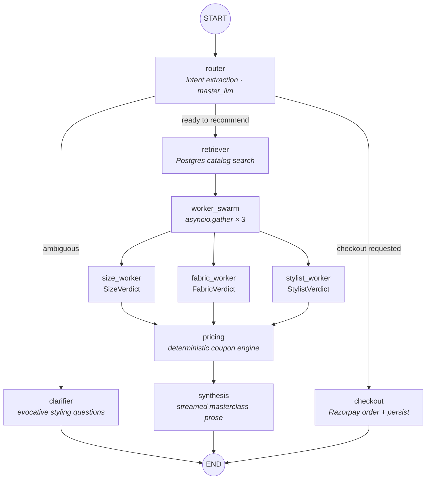

# KAZU — AI Styling Concierge


> **The invitation says dress to impress. KAZU makes sure you do**
>
> Type the occasion — *"beach wedding in Goa, under ₹4,000"* — and **STYLO**, your AI stylist, goes to work. A swarm of specialist agents debates the fit, the fabric, and the climate on your behalf; sizes you from your history; applies the best coupon; and drops you into a secure Razorpay checkout with a complete outfit locked.
>
> **From "what do I wear?" to "payment confirmed" — in one conversation.**

---

## What KAZU Does

KAZU is an **agentic AI e-commerce concierge** built for the Razorpay Buildathon. Instead of forcing shoppers to browse endless product grids, KAZU accepts a natural-language request — occasion, climate, budget, fit preference — and drives the entire purchase journey autonomously:

1. **Understands intent** from a single sentence — segment (Men/Women/Kids/Beauty), occasion, climate, budget, add-to-cart vs. checkout.
2. **Asks only what matters** — a clarifier node engages when intent is genuinely ambiguous, never as a delay tactic.
3. **Retrieves from a live catalog** (PostgreSQL/Supabase) with segment- and budget-scoped ranking.
4. **Evaluates like boutique staff** — three specialist agents run **in parallel**: a tailor (size/fit), a textile expert (fabric vs. your climate), and an editorial stylist (pairings & masterclass tips).
5. **Prices deterministically** — a coupon engine with verified discounts (no LLM in the money path).
6. **Synthesizes a stylist-grade response** and streams it token-by-token into the chat.
7. **Closes the sale** — freezes the order via Razorpay, verifies the payment cryptographically (HMAC-SHA256), records order history, and clears the cart.

## Demo Script (Talk → Checkout)

```
You:    "I need a breathable linen outfit for an outdoor beach wedding in Goa under 4000."

STYLO:  [Curating high-match candidate pieces from collection...]
        [Tailor & textile sub-agents evaluating fabric breathability & drape...]
        "The 150 GSM linen breathes effortlessly in coastal humidity… ₹2,499,
         sized L from your fit history — paired with the slim chinos."

You:    "Add the shirt and the trousers to my bag."

STYLO:  (adds exactly those two pieces — not the whole look)

You:    "Checkout with Razorpay — apply STYLE20."

STYLO:  → Frozen order → Razorpay modal opens → payment signature verified
        → Order lands in your /orders timeline → cart auto-cleared
```

## The Agent Architecture

STYLO isn't a chatbot wrapper — it's a **7-node LangGraph DAG** with conditional routing, parallel sub-agents, Postgres-backed multi-turn memory, and full LangSmith observability.



| Node | Responsibility | Model |
|---|---|---|
| `router` | Structured `IntentParser` extraction: segment, occasion, climate, budget, readiness, selective add-to-cart SKUs, checkout flag | Groq qwen3.8-27b · T=0.5 |
| `clarifier` | One warm, purposeful question when intent is vague | master |
| `retriever` | Deterministic token-ranked search over the Postgres catalog (segment + budget filters) | none |
| `worker_swarm` | 3 parallel verdict agents — size/fit, fabric/climate, styling/pairing | worker · T=0.1 |
| `pricing` | STYLE20 / AURA10 coupon math — fully deterministic | none |
| `synthesis` | Streamed, category-aware boutique prose + suggested follow-ups | master |
| `checkout` | Frozen Razorpay order **plus persisted Order row** for payment verification | none |

**Engineering details that matter:**

- **Dual-temperature strategy** — creative synthesis at T=0.5; structured verdict JSON at T=0.1.
- **Output-token bounding** — hard `max_tokens` caps sized so the swarm's peak reservation (3 × 250) stays under Groq's 1,000 output-tokens-per-minute free-tier ceiling.
- **Turn-scoped state** — swarm verdicts overwrite per turn (no stale-verdict leakage against rotating anchor products); prompt history is trimmed to the last 10 messages / 4k chars.
- **Honest fallbacks** — failed specialist evaluations are logged and flagged (`is_fallback`), never fabricated as high-confidence verdicts; empty retrieval produces an honest "we don't stock that" instead of a hallucinated pick.
- **Real token telemetry** — actual Groq `usage_metadata` aggregated per turn and returned in every response (no hardcoded numbers).

## The Storefront

A Puma-inspired, high-contrast retail UI — React 19, Vite, Tailwind v4:

- **Full-page chat studio** — Gemini-style session sidebar, token-live streaming, per-node agent telemetry ("Curating high-match candidates…"), inline product cards with the AI-chosen size, one-tap add-to-cart.
- **Persistent cart** — PostgreSQL-backed across refreshes and devices; size-aware line items with atomic upserts (`UNIQUE (user, product, size)`).
- **Orders timeline** — chronological, verified-payments-only history with product deep-links.
- **Catalog & search** — segment locks, server-side ranked search, recent-searches chips from your profile.
- **Theming** — CSS design tokens with dark/light modes and an extended custom color scale.

## Payments (Razorpay)

- Official Razorpay SDK order creation with **server-side HMAC-SHA256 signature verification**.
- Mock mode for local development (`order_mock_*`) when keys aren't configured — structurally identical end-to-end flow.
- Verify → mark `paid` → persist order → **cart wiped** in the same commit.
- Checkout reachable from two surfaces: the cart drawer, and conversational "Instant Buy" in chat (with an in-flight guard).

## Quality: LLM-as-a-Judge + Regression Tests

Multi-agent pipelines are non-deterministic, so `eval_pipeline.py` runs curated scenarios through the graph and grades each run across four dimensions — **Relevance, Persona, Recommendation Quality, Helpfulness** — plus deterministic route-accuracy and budget-compliance checks. Full judge critiques are archived per run (`eval_results/`).

Alongside it, **22 pytest regression tests** lock down the graph's state semantics (turn-scoped verdicts, coupon scoping, history trimming), cart integrity (upsert race, size validation, wrong-variant removal), session isolation, checkout-order persistence, rate limiting, and the honesty/fallback paths — several against the live Postgres schema.

## Tech Stack

| Layer | Tech |
|---|---|
| Agent framework | LangGraph `StateGraph` · PostgresSaver checkpointing |
| LLM | `qwen/qwen3.8-27b` via Groq (OpenAI-compatible) |
| Observability | LangSmith tracing · LLM-as-a-Judge evals |
| Backend | FastAPI + Uvicorn · SQLAlchemy 2.0 |
| Database | PostgreSQL (Supabase) — catalog, cart, orders, conversations, checkpoints |
| Payments | Razorpay Standard Checkout (official SDK) |
| Frontend | React 19 · Vite · Tailwind CSS v4 · react-router-dom 7 |

## Getting Started

### Prerequisites
- Python 3.11+, Node.js 20+
- Groq API key · Supabase Postgres connection string · Razorpay test keys (optional — mock checkout mode works without them)

### 1. Backend

```powershell
python -m venv venv
.\venv\Scripts\Activate.ps1
pip install -r requirements.txt
```

Create `.env` in the project root:

```ini
# REQUIRED
DATABASE_URL=postgresql://postgres:<password>@<host>:5432/postgres
GROQ_API_KEY=gsk_...

# RAZORPAY (optional — mock checkout if absent)
RAZORPAY_KEY_ID=rzp_test_...
RAZORPAY_KEY_SECRET=<your_key_secret>

# OBSERVABILITY (optional)
LANGCHAIN_TRACING_V2=true
LANGCHAIN_API_KEY=ls__...
LANGCHAIN_PROJECT=aura-fashion-agent

# TUNING (optional)
FRONTEND_ORIGINS=http://localhost:5173,http://127.0.0.1:5173
CHAT_RATE_LIMIT_PER_MIN=20
```

```powershell
python seed_db.py                     # one-time: seed the catalog into Postgres
uvicorn main:app --reload --port 8000
```

### 2. Frontend

```powershell
cd frontend
npm install
npm run dev          # http://localhost:5173 (dev proxy to :8000)
npm run build        # production bundle served by the backend at :8000
```

### 3. Quality Gates

```powershell
python -m pytest -v          # 22 regression tests
python eval_pipeline.py      # LLM-as-a-Judge benchmark → eval_results/
```

## Project Structure

```
├── main.py               # FastAPI — chat (SSE), cart, orders, search, checkout, OpenAI shim
├── graph.py              # LangGraph DAG + PostgresSaver checkpointer
├── nodes.py              # 7 nodes, worker swarm, prompts, token telemetry
├── schema.py             # AgentState channels (turn-scoped verdicts, token usage)
├── catalog_store.py      # Postgres-backed catalog retrieval & ranking
├── history_store.py      # Conversation persistence with per-user isolation
├── checkout_service.py   # Razorpay order creation + signature verification
├── db.py                 # SQLAlchemy models + self-healing schema backfills
├── eval_pipeline.py      # LLM-as-a-Judge harness · eval_dataset.py (scenarios)
├── test_p0_fixes.py      # Graph state, coupon scope, cart policy, session isolation
├── test_p1_fixes.py      # Cart upserts, rate limit, honesty/fallbacks, token usage
├── frontend/src/
│   ├── pages/            # Home · ChatPage (streaming studio) · Search · Orders · ProductDetails
│   ├── components/       # Navbar · ProductCard · CartDrawer · ui primitives
│   └── lib/              # Razorpay bridge · ThemeContext
├── decision.md           # Architecture decisions (What → Why → Trade-offs)
└── flow.md               # End-to-end system flow maps
```

## Roadmap

- [ ] Razorpay webhooks (`payment.captured` / `payment.failed`) as the authoritative payment signal
- [ ] Server-side order-total recomputation & idempotent checkout
- [ ] Real authentication (replaces the guest-user model)
- [ ] Vector/semantic catalog search
- [ ] Inventory, order state machine, refunds & returns
- [ ] Women / Kids / Beauty catalogs live (currently Men-only inventory)
- [ ] CI gate wired to eval pass-rate thresholds

---

*Built for the Razorpay Buildathon. **KAZU Atelier** — curated by conversation.*
