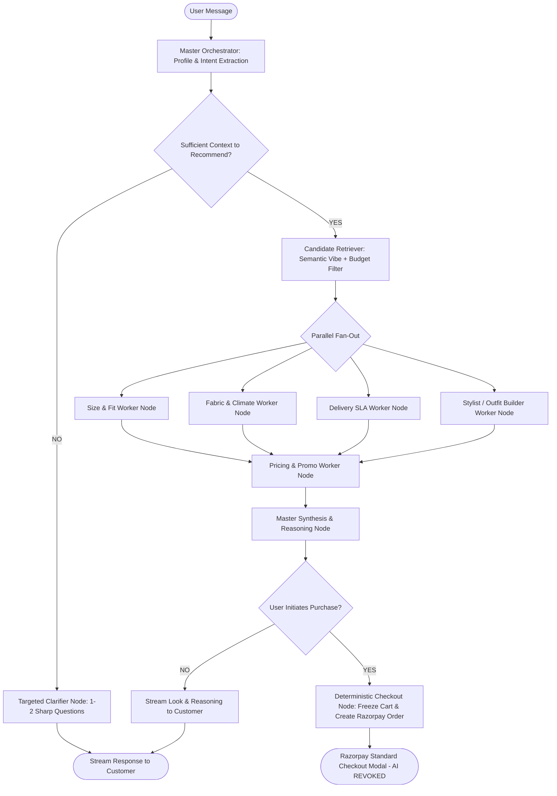

# LangGraph Multi-Agent E-Commerce Architecture Spec

## 1. High-Level Flow & Topology

The graph coordinates between a **Master Persona Node** (Qwen 3.8 27B / Gemini), **5 Parallel Attribute Evaluators** (Qwen 3.6 27B / Groq LPU), an **Auxiliary Vector Retriever** (ChromaDB / Qdrant), and a **Deterministic Razorpay Guardrail Node**.

